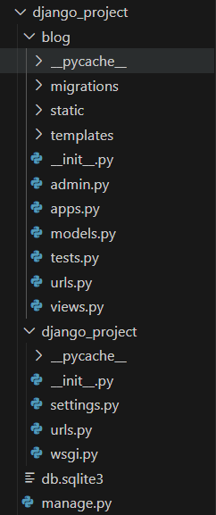
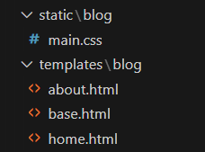
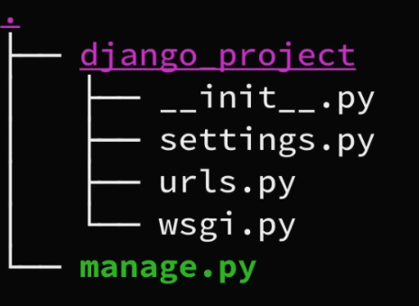

# Django Tutorial 1 - Basic Project

## 1.1 Project Structure


for static file, remember to put them in the sub folder having the same name.


Get the all available commands by `django-admin`

```[django]
    check
    compilemessages
    createcachetable
    dbshell
    diffsettings
    dumpdata
    flush
    inspectdb
    loaddata
    makemessages
    makemigrations
    migrate
    optimizemigration
    runserver
    sendtestemail
    shell
    showmigrations
    sqlflush
    sqlmigrate
    sqlsequencereset
    squashmigrations
    startapp
    startproject
    test
    testserver
```

then create template by `django-admin startproject <projectname>`



Then we can run the server ( in development mode) by `python manage.py runserver`


## 1.2 View

view.py in the custom app folder(e.g. the blog) is the core module of processing requests and return responses.It can be based on functions or classes.

Often we use render shortcut to simplify the process. **Remeber to import the following**

```python
from django.shortcuts import render
from django.http import HttpResponse
```

Below shows a typical response function
```python
# dummy posts
posts = [
    {
        'author':'yukun',
        'title':'Blog post 1',
        'date_postsed':'22 Sep 2024',
        'content': "Studying as fuck now wow"
    },
    {
        'author':'Bill',
        'title':'Blog post 2',
        'date_postsed':'26 Sep 2024',
        'content': "delulu is the solulu"
    }
]

def home(request):
    context = {
        'posts':posts,
    }
    return render(request, 'blog/home.html',context)
```
pass in context to the commands in the HTML file can create a dynamic page.

## 1.3 Static File
Can use HTML and CSS file to render the page and response.
should be place under 
- *template/\<appName\>* for HTML files
- *static/\<appName\>* for CSS files
-------------
Syntax for code block in the HTML files:

- Extend from base HTML file:
``
- Allow to load static file, like CSS templates:
``
- Load static
```HTML
<link rel="stylesheet" href="">
 <a class="nav-item nav-link" href="">Home</a>

```
- Control flows:
```HTML
 <!-- if var exists-->



 <!-- to generate an inheritable content block, can be overwritten in child files with same block name-->


  
      
```
## 1.4 URL File

This file serves as parse request URLs and bind them with views.

It's possible to set URLs with multiple levels, to making refactor easy.

using path, you can bind URL with view or other URL lists(Then they'll be put under that URL in path function)

***always using postfix slashes for URL!***, like `'blog/'`

```python
Function views
    1. Add an import:  from my_app import views
    2. Add a URL to urlpatterns:  path('', views.home, name='home')
Class-based views
    1. Add an import:  from other_app.views import Home
    2. Add a URL to urlpatterns:  path('', Home.as_view(), name='home')
Including another URLconf
    1. Import the include() function: from django.urls import include, path
    2. Add a URL to urlpatterns:  path('blog/', include('blog.urls'))
```

For example,
```python
# in file django_project/urls.py  <--- the parent project
urlpatterns = [
    path('admin/', admin.site.urls),
    path('blog/', include('blog.urls')),
]
# in file blog/urls.py  <--- the sub app
from django.urls import path
from . import views
from django.urls import path, include

urlpatterns = [
    path('', views.home, name='blog-home'),
    path('about/', views.about, name='blog-about'),
]
```
- admin page -> 'localhost:8088/admin'
- blog page -> 'localhost:8088/blog'
- about page -> 'localhost:8088/blog/about'


## 1.5 Admin

`python manage.py createsuperuser` to create admin