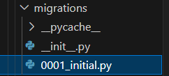

# Django Tutorial 2 - Database and Migration

## 2.1 Database

> Migration: to apply your changes to the models to the whole architecture.
using `python manage.py makemigrations`
- `python manage.py makemigrations` Create
- `python manage.py migrate` Apply
- `sqlmigrate` **Show SQL Queries** `python manage.py sqlmigrate blog 0001`
- `showmigrations`

------


`models.py` defines data models and database access.

Django uses a **Object-Orientated** way to manipulate the database, so we dont need to change the code when replacing the underlying database.

```python
from django.db import models
from django.utils import timezone
from django.contrib.auth.models import User
# Create your models here.

class Post(models.Model):
    title = models.CharField(max_length=100)
    content = models.TextField()    #Unrestricted Text
    date_posted = models.DateTimeField(default=timezone.now)
    author = models.ForeignKey(User,on_delete=models.CASCADE) 
```
if the key is deleted by the foreign table
- CASCADE : delete this row as well
- Others: SET_NULL: set the key to null, need manual repair
- DO_NOTHING: do nothing, but may leave problems
- PROTECT: stop the key from being deleted


using `python manage.py makemigrations`

It will make the following changes


Then check the SQL codes **Show SQL Queries** `python manage.py sqlmigrate blog 0001`

```SQL
CREATE TABLE "blog_post" ("id" integer NOT NULL PRIMARY KEY AUTOINCREMENT, "title" varchar(100) NOT NULL, "content" text NOT NULL, "date_posted" datetime NOT NULL, "author_id" integer NOT NULL REFERENCES "auth_user" ("id") DEFERRABLE INITIALLY DEFERRED);

CREATE INDEX "blog_post_author_id_dd7a8485" ON "blog_post" ("author_id");

COMMIT;
```

Then we apply the changes by `migrate`

## 2.2 Interactive shell

> Using `python manage.py shell` to enter interactive env

first import models you need.
```Python
>>>from blog.models import Post
>>>from django.contrib.auth.models import User

# Query
>>>Post.objects().all().first()
>>>Post.objects().filter().first()

#INSERT
>>post_1 = Post()# fill attributes
>>post_1.save()
```
----
There is also an easy query set to do search
> .modelname_set

access posts by user:
```Python
>>> user.post_set
```
> In [21]: user.post_set.all()
> Out[21]: <QuerySet [<Post: Blog 1>, <Post: Blog 2>]>

Can also create new rows with association to keys:

`user.post_set.create(title='Blog 3', content='Blog 3 content')`

## 2.3 Query data for webpage

We remove our dummy data first.

in `view.py`:

```Python
from .models import Post

def home(request):
    context = {
        'posts':Post.objects.all()
    }
    return render(request, 'blog/home.html',context)
```

then it's done!

To format the date in templates refer to [here](https://www.youtube.com/redirect?event=video_description&redir_token=QUFFLUhqa3lERXNIS0s5bFQ0cFJFUHNtcDBIWm9sS2Y4UXxBQ3Jtc0ttdUNuQjI1VHBlR3BFMXFUbjhhUjA0U2ZmWVRQTVdUUHJOdFFXcGRrbjUzeER0WU1jNkpsS29xLURITF9GYUxVb0FBU0NiMmZ5akFyUURIT2Z5Mjd0U2c4dmhnY256MzZ4VnlIakRIVlJVSUtWRnFvNA&q=https%3A%2F%2Fdocs.djangoproject.com%2Fen%2F2.0%2Fref%2Ftemplates%2Fbuiltins%2F%23date&v=aHC3uTkT9r8)

```HTML
<small class="text-muted">{{ post.date_posted|date:"G:i, F d, Y" }}</small>
```
What it looks like:
>6:43, September 26, 2024

## 2.4 Admin Page with Database
To add our model to admin page, we need to register them.

In `admin.py`:
```Python
from .models import Post
admin.site.register(Post)
```
